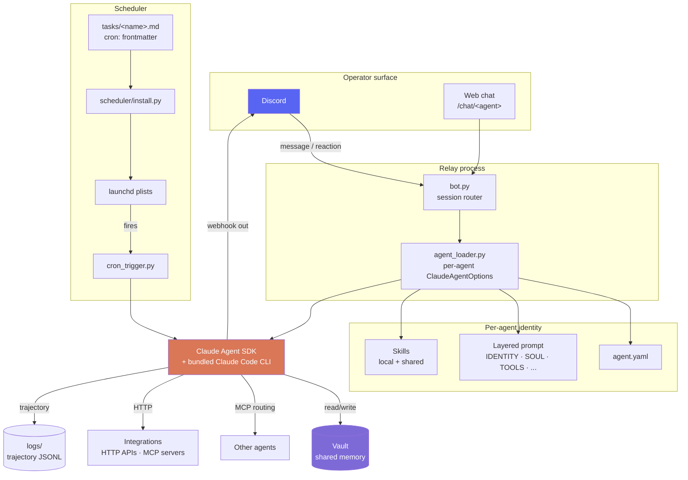

# AgentOS

A multi-agent operating system for Claude Code.

Run a team of specialist agents from a single Discord server. Each agent has its own channel, its own identity, and writes to a shared markdown vault you control. Agents talk to each other, schedule their own work via launchd, and survive context resets.

No API tokens, no hosted runtime, no vendor lock-in — runs on your Claude.ai subscription on your machine.

Built by [Dhruv Adhia](https://github.com/dhruvbreathe). MIT-licensed.

> **Status: early public release (v0.1).** Works today on macOS. Linux/Windows for everything except the launchd scheduler.

## Why AgentOS

| You want | AgentOS gives you |
|---|---|
| Specialist agents that hold their own context | One folder per agent, isolated identity, shared vault |
| Memory that survives session restarts | Markdown files. No bespoke vector store. |
| Cron without a server | launchd plists generated from `cron:` frontmatter |
| Routing between agents | Webhook-per-agent + cross-agent MCP messaging |
| Approval gates on dangerous commands | Discord-reaction approval (`✅` / `❌`) on a 60s timer |
| To run on Claude.ai, not API tokens | Bundled CLI auth, no API key required |

## How it works



The four ideas that make it tick:

- **Markdown is the memory layer.** Not a vector DB, not a graph store. Just files Claude can `Read`/`Write`/`Glob`/`Grep`. The simplicity is the feature.
- **Discord is the UI.** Free, multiplayer, mobile, push notifications, file uploads, reaction-based approval — all out of the box.
- **launchd is the scheduler.** No infrastructure. No cron daemon. Tasks are markdown files with `cron:` frontmatter.
- **Identity is layered prompt files, not config.** `IDENTITY.md` / `SOUL.md` / `TOOLS.md` etc. are loaded into each agent's system prompt. You write personality, not JSON.

For the deeper backstory on these decisions, see [`docs/JOURNEY.md`](docs/JOURNEY.md). For how AgentOS compares to other agent frameworks, see [`docs/COMPARISONS.md`](docs/COMPARISONS.md).

## What it gives you

- **One Discord channel per agent.** Each `agents/<name>/` folder is a self-contained agent — YAML config, layered system prompt, per-agent skills, per-agent tools/integrations, and optional scheduled tasks.
- **Live-streaming replies.** The bot posts a `…` placeholder and edits it every ~1.2s as tokens arrive, so long answers feel instant.
- **Cross-agent comms.** `allow_bots: true` lets agents reply to each other's webhook posts. Encourage `@<agent-name>` prefixes to keep routing legible.
- **Markdown-as-memory.** Every agent's `cwd` points at your vault. Claude's built-in `Read`/`Write`/`Glob`/`Grep` tools *are* the memory layer — no bespoke store.
- **Scheduled tasks.** Drop a `cron:` frontmatter line on any `agents/<name>/tasks/*.md` file and the scheduler installs a launchd plist that fires the task and posts its output to the agent's webhook.
- **Operator-reaction gates.** React `💾` on any message to save the turn to the vault. Dangerous `Bash` commands trigger a `✅/❌` approval prompt before executing.
- **An optional web dashboard** for watching agents live (`dashboard.py`), plus a trajectory log per session for post-hoc review.

## Quickstart

```bash
git clone https://github.com/dhruvbreathe/AgentOS.git
cd AgentOS
python -m venv .venv && source .venv/bin/activate
pip install -e ".[dashboard]"
cp .env.example .env        # fill in DISCORD_BOT_TOKEN, DISCORD_GUILD_ID, VAULT_PATH
```

The Claude Agent SDK ships with the Claude CLI bundled. If you prefer your system-wide install, set `cli_path` in an agent's `agent.yaml`.

### Run the bot (inbound: Discord → Claude → Discord)

```bash
python bot.py
# or, to auto-restart on crash / restart-request:
scripts/autorestart.sh
```

Per-channel session IDs are stored in `logs/sessions.json` so follow-ups in the same channel keep context.

### Outbound (scheduler → Claude → Discord webhook)

Each scheduled task is a markdown file under `agents/<agent>/tasks/<task>.md` with a `cron:` frontmatter line:

```markdown
---
cron: 0 8 * * *
---
Produce the 8am daily digest...
```

Install / refresh all schedules:

```bash
python scheduler/install.py             # dry-run — print plan
python scheduler/install.py --apply     # install & load launchd plists
python scheduler/install.py --list      # show currently-loaded jobs
python scheduler/install.py --remove-all
```

To run a task once manually:

```bash
python cron_trigger.py <agent> <task>
```

## Adding an agent

1. `cp -r agents/_template agents/<name>` and edit `agent.yaml`.
2. Fill in `channel_id` (right-click channel in Discord → Copy ID).
3. Set `webhook_url_env` to a var like `<NAME>_WEBHOOK_URL`; add that var to `.env` with the channel's webhook URL (`Channel → Integrations → Webhooks → New`).
4. Edit the system-prompt layers (`IDENTITY.md`, `SOUL.md`, `AGENTS.md`, `TOOLS.md`, `INTEGRATIONS.md`, `SCHEDULING.md`, `LEARNINGS.md`, `MEMORY.md`) — or point `system_prompt_file` at a single file.
5. Drop skill files in `skills/` (each `skills/<name>/SKILL.md` is appended to the system prompt at load time).
6. Optional: add MCP servers under `mcp_servers:` in `agent.yaml`.

Any path in an agent's `.md` docs that needs the repo root should use the `{AGENTOS_ROOT}` placeholder — `agent_loader.py` resolves it to the current install path at load time, keeping docs portable across machines.

## Layout

```
.
├── bot.py                  # long-running Discord listener
├── relay.py                # SDK runner + streaming sinks
├── cron_trigger.py         # one-shot task runner
├── agent_loader.py         # loads agents/*/agent.yaml + layered prompts
├── agent_tools.py          # SDK-custom tools (post-to-discord, etc.)
├── approval_gate.py        # Bash pre-tool-use approval hook
├── save_marker.py          # 💾 reaction → save-turn-to-vault handler
├── events.py               # cross-process event bus
├── dashboard.py            # optional FastAPI UI for watching agents live
├── tasks.py, tasks_routes.py
├── web_chat.py             # optional browser-based chat UI
├── transcribe.py           # audio-message transcription helper
├── config.yaml             # global defaults + save/stream/approval gates
├── .env.example
├── agents/
│   ├── _template/          # copy this to seed a new agent
│   └── ...                 # your agents
├── shared/                 # cross-agent prompt fragments + skills
├── scripts/                # doctor, audit, seed_tasks, launch_dashboard, etc.
├── scheduler/install.py    # launchd plist generator
├── cron/install.py         # legacy crontab installer (kept for reference)
├── connectors/             # per-integration HTTP wrappers
└── docs/                   # JOURNEY, COMPARISONS, architecture diagram
```

## Requirements

- Python 3.10+
- macOS (for the launchd scheduler; everything else is cross-platform)
- A Claude.ai account (the SDK authenticates via the bundled CLI)
- A Discord server you can create bots and webhooks in

## Documentation

- [`docs/JOURNEY.md`](docs/JOURNEY.md) — the design decisions behind AgentOS, and what we tried that didn't work
- [`docs/COMPARISONS.md`](docs/COMPARISONS.md) — AgentOS vs OpenClaw, Mastra, LangGraph, AutoGen, claude-flow

## Credits

Built on the [Claude Agent SDK](https://github.com/anthropics/claude-agent-sdk-python) from Anthropic. The humanizer / caveman / expression prompt fragments under `shared/` are adapted from their respective authors — see the file headers for provenance.

## License

MIT — see [LICENSE](LICENSE).
