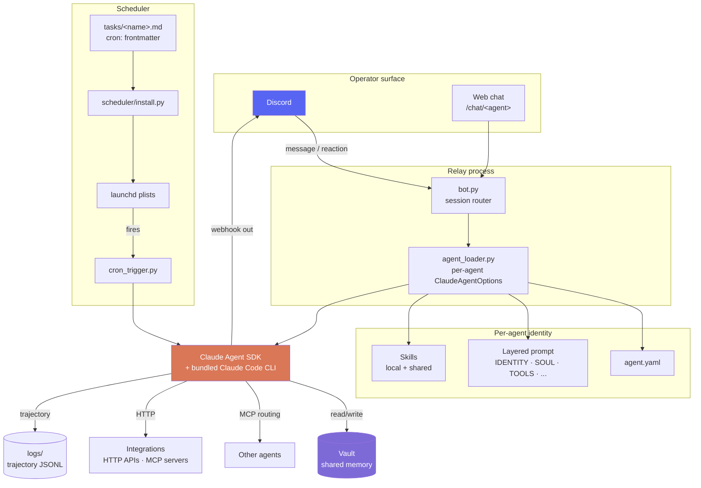

<div align="center">

# AgentOS

**A multi-agent operating system for Claude Code.**

Run a team of specialist agents from a single Discord server. One channel per agent. One folder per agent. A shared markdown vault as their memory. Cross-agent routing, scheduled tasks, approval gates, and a web dashboard — all on your Claude.ai subscription, on your machine.

[](LICENSE)
[](https://www.python.org/downloads/)
[](#roadmap)
[](https://github.com/anthropics/claude-agent-sdk-python)
[](#requirements)
[](#how-it-works)

[**Quickstart**](#quickstart) · [**How it works**](#how-it-works) · [**Showcase**](#showcase) · [**Examples**](#examples) · [**Docs**](docs/) · [**FAQ**](#faq) · [**Roadmap**](#roadmap)

</div>

---

> **Status:** early public release (v0.1). Works today on macOS. Linux/Windows for everything except the launchd scheduler.

Built by [Dhruv Adhia](https://github.com/dhruvbreathe). MIT-licensed. Pull requests welcome.

---

## Table of contents

- [Why AgentOS](#why-agentos)
- [How it works](#how-it-works)
- [What it gives you](#what-it-gives-you)
- [Showcase: Prana Labs](#showcase)
- [Quickstart](#quickstart)
- [Examples](#examples)
  - [A minimal `agent.yaml`](#a-minimal-agentyaml)
  - [A scheduled task](#a-scheduled-task)
  - [A skill](#a-skill)
  - [An agent's layered identity](#an-agents-layered-identity)
- [Adding an agent](#adding-an-agent)
- [Layout](#layout)
- [Architecture deep-dive](#architecture-deep-dive)
- [Memory model](#memory-model)
- [Safety: approvals and audits](#safety-approvals-and-audits)
- [Roadmap](#roadmap)
- [FAQ](#faq)
- [Requirements](#requirements)
- [Documentation](#documentation)
- [Contributing](#contributing)
- [Credits](#credits)
- [License](#license)

---

## Why AgentOS

You don't need a hosted runtime, a vector store, or a graph DSL to give yourself a virtual team of specialists. You need a place where each one can hold its own context, talk to the others, remember what it did yesterday, and run on a schedule without you babysitting it.

| You want | AgentOS gives you |
|---|---|
| Specialist agents that hold their own context | One folder per agent, isolated identity, shared vault |
| Memory that survives session restarts | Markdown files — no bespoke vector store |
| Cron without a server | launchd plists generated from `cron:` frontmatter |
| Routing between agents | Webhook-per-agent + cross-agent MCP messaging |
| Approval gates on dangerous commands | Discord-reaction approval (`✅` / `❌`) on a 60s timer |
| To run on Claude.ai, not API tokens | Bundled CLI auth, no API key required |
| To read every cross-agent message yourself | Every route is a Discord post; nothing is hidden |
| To pick up the project in 90 minutes | ~3.5k lines of Python you can read end-to-end |

If a hosted multi-agent runtime is what you want, [Mastra](https://mastra.ai) or [LangGraph](https://github.com/langchain-ai/langgraph) might fit better. If you want a single-host, operator-in-the-loop system you can fork and read, you're in the right place.

---

## How it works



### The four ideas that make it tick

1. **Markdown is the memory layer.** Not a vector DB, not a graph store. Just files Claude can `Read` / `Write` / `Glob` / `Grep`. The simplicity is the feature. Obsidian on top of the same folder gives you wiki-links, graph view, and semantic search without changing the underlying data.
2. **Discord is the UI.** Free, multiplayer, mobile, push notifications, file uploads, reaction-based approval — all out of the box. Each agent gets its own channel; each channel becomes a durable scrollback for one role.
3. **launchd is the scheduler.** No infrastructure, no daemon, no Docker. Tasks are markdown files with a `cron:` frontmatter line. The installer translates them into per-user launchd plists.
4. **Identity is layered prompt files, not config.** `IDENTITY.md`, `SOUL.md`, `TOOLS.md`, `LEARNINGS.md`, etc. are concatenated into each agent's system prompt. You write personality, not JSON. The agent itself can `Write` to `LEARNINGS.md` and `MEMORY.md` to evolve over sessions.

For the long-form thinking behind these choices, read [`docs/JOURNEY.md`](docs/JOURNEY.md). For honest comparisons against OpenClaw, Mastra, LangGraph, AutoGen, and claude-flow, read [`docs/COMPARISONS.md`](docs/COMPARISONS.md).

---

## What it gives you

- **One Discord channel per agent.** Each `agents/<name>/` folder is a self-contained agent — YAML config, layered system prompt, per-agent skills, per-agent tools and integrations, and optional scheduled tasks. The bot maps incoming messages to the right agent by channel ID.
- **Live-streaming replies.** The bot posts a `…` placeholder and edits it every ~1.2s as tokens arrive, so long answers feel instant and the operator can interrupt mid-stream.
- **Cross-agent comms.** `allow_bots: true` lets agents reply to each other's webhook posts. A built-in MCP tool `mcp__agent_comms__send_to_agent` adds a `(via @sender, hop N/M)` header with a hop cap of 3 to prevent loops. Every cross-agent message is visible to the operator.
- **Markdown-as-memory.** Every agent's `cwd` points at your vault. Claude's built-in `Read` / `Write` / `Glob` / `Grep` tools *are* the memory layer — no bespoke store. Notes are still just markdown; Obsidian works on top of them without coupling.
- **Scheduled tasks.** Drop a `cron:` frontmatter line on any `agents/<name>/tasks/*.md` file and the scheduler installs a launchd plist that fires the task and posts its output to the agent's webhook. `kind: systemEvent` makes a task run silently (no Discord post — useful for hygiene jobs).
- **Operator-reaction gates.** React `💾` on any message to save the turn to the vault as a markdown session log. Dangerous `Bash` commands trigger a `✅` / `❌` approval prompt before executing, with a 60-second auto-deny timeout.
- **Skills system.** Drop a `SKILL.md` under `shared/skills/<name>/` or `agents/<name>/skills/<name>/`, reference it as `skill:<name>` or `local:<name>` in `agent.yaml`, and it gets appended to that agent's system prompt at load time.
- **An optional web dashboard.** `dashboard.py` is a FastAPI app that shows live agent state, an effective-config viewer per agent, in-browser editing of `agent.yaml`, and `/chat/<agent>` for browser-based chat with any agent (useful for mobile and for guests who shouldn't be in your Discord).
- **Trajectory logs.** Every session writes one JSONL file at `logs/trajectories/<agent>/<session_id>.jsonl` containing prompts, tool calls, tool results, and final text. Enough for one operator to reconstruct what happened.
- **Audio messages.** Drop a voice memo in Discord; the bot transcribes it via OpenAI Whisper (or any compatible endpoint) and feeds the text to the agent.

---

## Showcase

The largest known deployment of AgentOS today is at **[Prana Labs](https://vayu-prana.com)** — the team behind the [Vayu](https://apps.apple.com/app/vayu-breathwork) breathwork + biofeedback app. A two-person founding team runs the company through roughly 17 specialist agents:

| Pod | Agents | What they do |
|---|---|---|
| **Orchestration** | `main` (Vayu), `project-manager` (Tempo) | Founder-facing daily pulse, cross-pod routing, scrum |
| **Product** | `ios-developer`, `android-developer`, `backend-developer`, `web-developer`, `qa`, `ui-ux-designer` | Ship the apps + web; QA regression; design system |
| **Growth** | `marketing` (Mira), `social-media` (Echo), `media` (Pixel), `ads` (Ember), `reddit-crawler` (Rook) | Outbound, content, paid acquisition, community |
| **Intel** | `market-intelligence-engine` (Orion), `research-labs` (Siddha), `deepali` | Competitive landscape, preprint scanning, user research |
| **Platform** | `security` (Sentry), `atlas` | Permissions/credentials hygiene, data plumbing |

What this actually looks like day to day:

- 8 AM and 8 PM, a daily digest from the main agent in `#virtual-ceo-cto-dhruv`
- 9 AM weekday scrum from project-manager, fanning items to the relevant agent's channel
- Marketing runs a 09:00 prospecting cron + 17:00 reply-report cron, scheduled via launchd plists
- A weekly Reddit roundup at Sunday 18:00 from the reddit-crawler
- Founder asks "what's the user-research read on chronic dyspnea this month" → routes to deepali → posts a synthesis with linked vault notes
- Every agent writes to the same Obsidian vault; "what did marketing decide last Tuesday" is a `grep` away

The full set of agents, their skills, and the cross-agent routing patterns are in this repo as a working example. You can fork it and replace the agents with your own.

---

## Quickstart

```bash
git clone https://github.com/dhruvbreathe/AgentOS.git
cd AgentOS
python -m venv .venv && source .venv/bin/activate
pip install -e ".[dashboard]"
cp .env.example .env        # fill in DISCORD_BOT_TOKEN, DISCORD_GUILD_ID, VAULT_PATH
```

The Claude Agent SDK ships with the Claude CLI bundled. If you'd rather use your system-wide install, set `cli_path` on a per-agent basis in `agent.yaml`.

### Run the bot

```bash
python bot.py
# or, to auto-restart on crash / restart-request:
scripts/autorestart.sh
```

Per-channel session IDs are stored in `logs/sessions.json` so follow-ups in the same channel keep context across the bot restarting.

### Install scheduled tasks

```bash
python scheduler/install.py             # dry-run — print plan, touch nothing
python scheduler/install.py --apply     # install & load launchd plists
python scheduler/install.py --list      # show currently-loaded jobs
python scheduler/install.py --remove-all
```

To fire a task once manually (skipping the scheduler):

```bash
python cron_trigger.py <agent> <task>
```

### Optional: run the dashboard

```bash
scripts/launch_dashboard.sh       # FastAPI on :8000, auto-opens in browser
```

The dashboard shows live agent status, lets you edit `agent.yaml` and the layered prompt files in-browser, and exposes a `/chat/<agent>` endpoint for browser-based chat. Cloudflare quick-tunnel friendly if you want to access it from your phone.

---

## Examples

### A minimal `agent.yaml`

```yaml
# agents/marketing/agent.yaml
name: marketing
channel_id: "1469778689322647800"
webhook_url_env: MARKETING_WEBHOOK_URL

# Leave system_prompt_file empty to use the layered files
# (IDENTITY.md + SOUL.md + USER.md + AGENTS.md + TOOLS.md + ...).
system_prompt_file: ""

# Skills appended after the layered prompt
skills:
  - skill:dev-browser           # shared, resolves to shared/skills/dev-browser/SKILL.md
  - skill:summarize             # shared
  - local:apollo-outreach       # per-agent, resolves to agents/marketing/skills/apollo-outreach/SKILL.md

# Only a subset of tools enabled
allowed_tools:
  - Read
  - Write
  - Edit
  - Glob
  - Grep
  - Bash
  - WebFetch
  - WebSearch
  - Task

# Override the default model (config.yaml) for this agent only
model: claude-sonnet-4-6

# Allow this agent to read messages from other bots in its channel
allow_bots: true

# MCP servers this agent can call. type: mcp inherits from the parent
# Claude Code CLI's MCP config, so no per-agent stdio transport needed.
mcp_servers:
  apollo:
    type: mcp
  gmail:
    type: mcp
  agent_comms:
    type: mcp

# Env vars to expose to this agent's Bash tool
env_passthrough:
  - APOLLO_API_KEY
  - GMAIL_OAUTH_CLIENT_ID
```

### A scheduled task

```markdown
---
cron: 0 9 * * 1-5
---
# Daily prospecting

Run my daily Apollo prospecting flow:

1. Pull the next 25 contacts from the active sequence
2. Score them against `Topics/Ideal-Customer-Profile.md`
3. Drop low-scorers, replace with the next 10
4. Write a session log to `Sessions/$(date +%F)-marketing-daily-prospecting.md`
5. Post a one-line summary to my channel: how many contacted, how many replied since yesterday
```

Drop that file at `agents/marketing/tasks/daily_prospecting.md`. Run `python scheduler/install.py --apply`. A launchd plist now fires the task at 9 AM, weekdays. Output posts to the agent's webhook (unless `kind: systemEvent` is set, in which case it runs silently).

### A skill

```markdown
---
name: apollo-outreach
description: |
  Apollo.io outreach playbook — search, sequence, reply.
  Triggers: "find leads", "add to sequence", "follow up on Apollo", "check reply rate".
---

# Apollo outreach

## When to use this
- Operator asks for new B2B leads matching a profile
- Need to enroll contacts into an existing sequence
- Pull reply-rate or sequence performance numbers

## Process
1. ...
2. ...

## Common pitfalls
- ...
```

Drop the file at `agents/marketing/skills/apollo-outreach/SKILL.md`. Reference it from `agent.yaml` as `local:apollo-outreach`. The contents append to the agent's system prompt at session load.

### An agent's layered identity

Each agent's identity is a set of markdown files, concatenated in order:

```
agents/marketing/
├── IDENTITY.md       # Name. Role. Vibe. The shortest of the layered files.
├── SOUL.md           # Values. Style. What this agent cares about and won't do.
├── USER.md           # Who the agent serves. Their preferences and dislikes.
├── AGENTS.md         # Workspace contract. How to read/write, what's safe.
├── TOOLS.md          # Paths, env vars, channels this agent uses.
├── INTEGRATIONS.md   # Connected services (Apollo, Gmail, Mixpanel, etc.).
├── SCHEDULING.md     # How this agent schedules its own recurring work.
├── LEARNINGS.md      # Durable lessons (append-only).
├── MEMORY.md         # Curated facts the agent keeps about its world.
```

A few snippets from a real agent's `IDENTITY.md`:

```markdown
- **Name:** Mira
- **Creature:** a careful courier with a steady hand on the cold-call line
- **Vibe:** warm, specific, never spray-and-pray
- **Emoji:** ✉️
- **Role:** Outbound and lifecycle marketing for Prana Labs
- **Context:** I'm the marketing agent inside the Prana Agent OS.
  My north star is reply rate, not send volume.
```

The system prompt the SDK sees for this agent is the concatenation of `shared/HUMANIZER.md`, `shared/EXPRESSION.md`, `shared/AGENT_COMMS.md`, `shared/MEMORY.md`, `shared/WORKSPACE.md`, plus all the layered files above, plus any skills declared in `agent.yaml`. The whole thing is just markdown the operator can read.

---

## Adding an agent

```bash
python scripts/new_agent.py <name>
```

That scaffolds `agents/<name>/` from `agents/_template/` with a `BOOTSTRAP.md` walkthrough for the first session. Then:

1. Fill in `channel_id` in `agent.yaml` (right-click channel in Discord → Copy ID).
2. Create the webhook (`Channel → Integrations → Webhooks → New`) and add the URL to `.env` under whatever `webhook_url_env` is set to.
3. Edit `IDENTITY.md` and `SOUL.md` first — name, role, voice. The rest you can grow into.
4. Drop skill files in `agents/<name>/skills/<skill-name>/SKILL.md` for anything agent-specific.
5. If you want recurring work, write a task at `agents/<name>/tasks/<name>.md` with a `cron:` frontmatter, then `python scheduler/install.py --apply`.

Any path in an agent's `.md` docs that needs the repo root should use the `{AGENTOS_ROOT}` placeholder — `agent_loader.py` resolves it to the current install path at load time, keeping docs portable across machines.

---

## Layout

```
.
├── bot.py                  # long-running Discord listener
├── relay.py                # SDK runner + streaming sinks
├── cron_trigger.py         # one-shot task runner
├── agent_loader.py         # loads agents/*/agent.yaml + layered prompts
├── agent_tools.py          # SDK-custom tools (post-to-discord, etc.)
├── approval_gate.py        # Bash pre-tool-use approval hook
├── checkpoint_gate.py      # rollback / checkpoint hook
├── lint_gate.py            # post-write markdown lint hook
├── save_marker.py          # 💾 reaction → save-turn-to-vault handler
├── events.py               # cross-process event bus
├── dashboard.py            # optional FastAPI UI for watching agents live
├── dashboard_edit.py       # in-browser yaml + layered-file editor
├── tasks.py, tasks_routes.py
├── web_chat.py             # browser-based chat UI (/chat/<agent>)
├── transcribe.py           # audio-message transcription helper
├── config.yaml             # global defaults: streaming, approval, save markers
├── .env.example
│
├── agents/
│   ├── _template/          # copy this to seed a new agent
│   │   ├── agent.yaml
│   │   ├── IDENTITY.md SOUL.md USER.md AGENTS.md ...
│   │   ├── skills/
│   │   └── tasks/
│   └── <your-agents>/
│
├── shared/                 # cross-agent prompt fragments + skills
│   ├── HUMANIZER.md        # rules for not sounding like AI
│   ├── EXPRESSION.md       # Discord-formatting + emoji rules
│   ├── AGENT_COMMS.md      # cross-agent routing protocol
│   ├── MEMORY.md           # memory architecture, every agent inherits
│   ├── WORKSPACE.md        # standard per-agent folder layout
│   ├── MODELS.md           # when to use opus vs sonnet vs haiku
│   ├── APPROVALS.md        # approval-gate contract
│   ├── CAVEMAN.md          # compressed-prose mode
│   ├── FILE_DELIVERY.md    # how to attach files in Discord
│   └── skills/             # skills any agent can opt into via `skill:<name>`
│
├── scripts/                # one-off helpers
│   ├── doctor.py           # health check every agent
│   ├── status.py           # aggregate structured status per agent
│   ├── audit_skills.py     # scan skill files for prompt injection
│   ├── audit_secrets.py    # scan for leaked credentials
│   ├── maintain_memory.py  # weekly memory distillation
│   ├── new_agent.py        # scaffold a new agent
│   ├── defer.py            # one-shot future task scheduler
│   ├── recall.py           # CLI search across vault + trajectories
│   └── ...
│
├── scheduler/install.py    # launchd plist generator
├── cron/install.py         # legacy crontab installer (deprecated, kept for reference)
├── connectors/             # per-integration HTTP wrappers
├── docs/                   # JOURNEY, COMPARISONS, architecture diagrams
├── logs/                   # session JSONL + trajectory JSONL (gitignored)
├── certs/                  # local TLS certs for dashboard (gitignored)
└── vercel-proxy/           # optional Vercel front-door for the dashboard
```

---

## Architecture deep-dive

### Inbound (operator → Claude)

1. `bot.py` is a discord.py client that listens on every channel mapped to an agent.
2. On a message, it consults `logs/sessions.json` for a prior session ID on that channel, then calls `agent_loader.load(agent_name)` to assemble `ClaudeAgentOptions`.
3. `agent_loader.py` walks the agent's folder, reads `agent.yaml`, concatenates the layered markdown files into the system prompt, resolves declared skills (shared or local), and merges the cross-agent defaults from `config.yaml`.
4. `relay.py` runs the SDK session and streams tokens back to a Discord message that updates every ~1.2 seconds.
5. Hooks fire at the right moments:
   - `PreToolUse` on `Bash` — checks against the dangerous-pattern list in `config.yaml`; if matched, posts an approval prompt and pauses until reaction or 60s timeout.
   - `PostToolUse` on `Write`/`Edit` for markdown files — runs `markdownlint-cli2` with the configured rule set and surfaces findings.
   - `Stop` — appends a breadcrumb to `agents/<name>/memory/YYYY-MM-DD.md`.
   - `PreCompact` — same writeback before Claude Code compacts context.
6. The reply lands in Discord. The session ID is persisted so the next message picks up where this one left off.

### Outbound (scheduler → Claude → Discord)

1. `scheduler/install.py` walks `agents/*/tasks/*.md`, parses cron frontmatter, and writes one launchd plist per task to `~/Library/LaunchAgents/com.agentos.<agent>-<task>.plist`.
2. At the scheduled time, launchd fires `cron_trigger.py <agent> <task>`.
3. `cron_trigger.py` loads the agent, runs a single prompt (the task file body) through the SDK, and posts the result to the agent's webhook URL — unless the task is marked `kind: systemEvent`, in which case the output stays in the trajectory log only.

### Cross-agent routing

The MCP tool `mcp__agent_comms__send_to_agent(agent, message)` posts to the target's webhook with a routing header:

```
📡 @marketing (via @main, hop 1/3)
<the message>
```

The receiving agent sees the header, strips it, and decides whether to respond. Hop count is capped at 3 to prevent runaway loops. Every routed message is a normal Discord post — the operator sees the whole conversation.

### Web surface

`dashboard.py` is a FastAPI app on `:8000`. It:

- Lists all agents and their current status (last seen, scheduled tasks, channel link)
- Shows the effective system prompt for any agent (the concatenation of all layered files + skills + shared docs as the SDK actually sees it)
- Lets you edit `agent.yaml` and any layered `.md` file in-browser, with diff preview
- Exposes `/chat/<agent>` — a browser chat UI that hits the same relay code path the Discord bot does
- Pairs cleanly with `cloudflared tunnel --url http://localhost:8000` for mobile access

---

## Memory model

Memory is layered, from fastest to most durable:

| Layer | Where | Lifetime |
|---|---|---|
| In-turn | Claude's context window | Ephemeral |
| Session | `logs/sessions.json` + Claude Code session resume | Until session ends |
| Trajectory | `logs/trajectories/<agent>/<session>.jsonl` | Forever (gitignored) |
| Breadcrumbs | `agents/<agent>/memory/YYYY-MM-DD.md` | Until weekly archive |
| Durable lessons | `agents/<agent>/LEARNINGS.md` | Loaded into prompt every session |
| Identity | `IDENTITY.md` / `SOUL.md` / `USER.md` / ... | Loaded every session |
| Shared brain | Obsidian vault at `cwd` | Forever, operator-editable |

The rule: **if a thought matters past the end of this turn, it gets written to a file.**

The vault is *shared* across all agents. Marketing can read a session log written by engineering yesterday. The user-research agent can update a `Topics/<Person>.md` that the orchestrator reads in tomorrow's morning digest. Cross-agent state lives in `Company/FACTS.md` — a structured key-value file every agent treats as canonical for "what's the current X".

Weekly, `scripts/maintain_memory.py` runs (as a scheduled task per agent) and distills patterns from `memory/YYYY-MM-DD.md` into `LEARNINGS.md`, archiving the raw notes into `memory/archive/YYYY-MM/`.

---

## Safety: approvals and audits

### Runtime approval

`config.yaml` has a list of `dangerous_patterns` that trip the approval gate before a `Bash` command runs. The defaults cover:

- File destruction (`rm -rf`, `git clean -f*`, `git reset --hard`)
- History rewriting (`git push --force`, `git push -f`)
- Service management (`launchctl bootout`, `launchctl remove`)
- Storage wipe (`diskutil erase`, `mkfs`, `dd if=`)
- Privilege escalation (`sudo`)
- Remote-execute patterns (`curl ... | sh`)
- Shutdown / reboot
- Writes to canonical decision logs in the vault
- Writes to `.env`

When triggered, a `🔐 Approval needed` message posts in the agent's channel with the command and the matched pattern. The operator reacts `✅` to approve or `❌` to deny. 60-second timeout auto-denies.

### Static audit

```bash
python scripts/audit_skills.py            # scan all agents' skill + identity files
python scripts/audit_skills.py <agent>    # one agent
python scripts/audit_skills.py --shared   # include shared/ docs
```

Reports prompt-injection patterns ("ignore all previous instructions"), exfiltration attempts, and literal credentials in any agent-writable file. Report-only — the operator reads findings and decides what to fix.

```bash
python scripts/audit_secrets.py
```

Scans for credential leaks across the repo and gitignored areas (logs, certs, .env).

---

## Roadmap

Honest status of what's planned and what isn't.

### Soon (next ~3 months)

- [ ] **Linux scheduler.** systemd-timer port of `scheduler/install.py`. Keep the same `cron:` frontmatter authoring surface.
- [ ] **Slack adapter.** Same per-channel model as Discord. Behind a config toggle so an install can run Discord-only, Slack-only, or both.
- [ ] **Better skill audit.** Right now it's regex; would like to add a small LLM pass for context-sensitive prompt injection.
- [ ] **Built-in trajectory viewer.** Today you `cat | jq` the JSONL. Dashboard panel for browsing trajectories with tool-call diff view.

### Considering (no commitment)

- [ ] **Windows Task Scheduler** port for the scheduler module.
- [ ] **First-class voice replies** (not just transcription on the way in).
- [ ] **Templated agent personas** — "marketing", "research", "engineering" starter packs you can drop in.
- [ ] **Cross-agent event bus** that doesn't go through Discord (for hot-path coordination).

### Explicitly out of scope

- A hosted SaaS version. The point is you own the data and the runtime.
- A graph DSL. If you want graphs, use LangGraph.
- High-throughput API-shape workloads. AgentOS is operator-in-the-loop by design.

---

## FAQ

**Does this need an Anthropic API key?**
No. AgentOS authenticates through the bundled Claude Code CLI, which uses your Claude.ai subscription. If you'd rather use the API, point `cli_path` and inject `ANTHROPIC_API_KEY` per agent — but the default flow is subscription-based.

**Why Discord and not Slack/Telegram/Matrix?**
Discord has the best free tier for this shape: unlimited message history, free bots, free webhooks, reaction APIs, file uploads, mobile push notifications, voice memos. Slack works in principle (and is on the roadmap) but the free tier limits message history. Telegram and Matrix are credible alternates if you want to port the bot.

**Do I need Obsidian?**
No. The vault is just a folder of markdown files. Obsidian on top adds graph view, wiki-links, and Smart Connections semantic search — all of which agents can use through MCP servers — but the system works on plain text.

**How much does it cost to run?**
The dominant cost is your Claude.ai subscription (currently $20–200/month depending on plan). The Discord server is free. The launchd scheduler is free. The dashboard runs locally for free. If you add paid integrations (Apollo, Mixpanel, etc.) you pay for those — but the AgentOS layer itself adds nothing.

**Can multiple operators use the same install?**
Yes, sort of. Discord is multiplayer by nature, so two humans can both DM agents in the same server. But each install has one Claude.ai auth — so the *agents* are running on one subscription. For team installs, each operator running their own AgentOS pointed at the same vault is the cleaner shape today.

**Can agents talk to LLMs other than Claude?**
Through MCP servers, yes. The agent itself runs on Claude (via the SDK), but it can call out to other models through MCP. Native multi-provider support is not planned.

**Can I run two agents at once?**
A single agent can run only one turn at a time per channel. Different agents run independently and concurrently — that's the whole point. Cross-agent calls via webhook are async by default.

**What happens if Claude.ai changes its model behind the scenes?**
You can pin a specific model per agent via `model:` in `agent.yaml`. The defaults track Anthropic's recommended versions; pinning is the escape hatch.

**What if my install gets to ~30 agents?**
Probably fine. The 17-agent Prana Labs install is the largest known. Each agent only spins up when its channel gets a message or its scheduler fires, so idle agents cost nothing. The dashboard and `doctor.py` may slow down past ~50 agents — would welcome PRs.

---

## Requirements

- **Python 3.10+**
- **macOS** for the launchd scheduler; everything else (bot, dashboard, agents) is cross-platform
- **A Claude.ai account** (the SDK authenticates via the bundled CLI; no API key needed)
- **A Discord server** you can create bots and webhooks in
- **A folder you want as the shared vault** (Obsidian-compatible, but plain markdown works)

Optional:

- Obsidian (for graph view, wiki-links, Smart Connections)
- An OpenAI-compatible endpoint for Whisper (for audio-message transcription)
- Per-integration accounts: Mixpanel, Apollo, Gmail, Supabase, GitHub, etc.

---

## Documentation

- [`docs/JOURNEY.md`](docs/JOURNEY.md) — the design decisions behind AgentOS, and what we tried that didn't work
- [`docs/COMPARISONS.md`](docs/COMPARISONS.md) — AgentOS vs OpenClaw, Mastra, LangGraph, AutoGen, claude-flow
- [`shared/HUMANIZER.md`](shared/HUMANIZER.md) — the prose rules every agent inherits (don't sound like AI)
- [`shared/EXPRESSION.md`](shared/EXPRESSION.md) — Discord formatting + emoji conventions
- [`shared/MEMORY.md`](shared/MEMORY.md) — the memory architecture in detail
- [`shared/WORKSPACE.md`](shared/WORKSPACE.md) — the standard per-agent folder layout
- [`shared/APPROVALS.md`](shared/APPROVALS.md) — the approval-gate contract
- [`CONTRIBUTING.md`](CONTRIBUTING.md) — how to contribute

---

## Contributing

Pull requests welcome. Read [`CONTRIBUTING.md`](CONTRIBUTING.md) first — the design goal is to stay small, readable, and hackable, so contributions that simplify or harden the core are more interesting than ones that add surface area.

Good first PRs:

- Linux systemd port of `scheduler/install.py`
- Slack adapter for `bot.py`
- A trajectory viewer panel in `dashboard.py`
- Additional starter agents in `agents/_template/` style (a generic "researcher", "writer", "ops" persona)
- Audit improvements in `scripts/audit_skills.py`

If you're not sure whether a change fits, open an issue first to discuss.

---

## Credits

Built on the [Claude Agent SDK](https://github.com/anthropics/claude-agent-sdk-python) from Anthropic. The bundled Claude Code CLI does the heavy lifting.

The `shared/HUMANIZER.md` rules are adapted from the [Wikipedia: Signs of AI writing](https://en.wikipedia.org/wiki/Wikipedia:Signs_of_AI_writing) essay. `shared/CAVEMAN.md` is adapted from the [Caveman](https://github.com/JuliusBrussee/caveman) prompt by Julius Brussee.

Honest comparisons against [OpenClaw](https://github.com/openclaw/openclaw), [Mastra](https://mastra.ai), [LangGraph](https://github.com/langchain-ai/langgraph), [AutoGen](https://github.com/microsoft/autogen), and [claude-flow](https://github.com/ruvnet/claude-flow) — go read those projects, too. The agent-framework space is small and most of us are figuring this out in public.

---

## License

MIT — see [LICENSE](LICENSE).

---

<div align="center">

If AgentOS saves you time, [⭐ star the repo](https://github.com/dhruvbreathe/AgentOS) — it helps other people find it.

Questions? Open an [issue](https://github.com/dhruvbreathe/AgentOS/issues) or find Dhruv on [GitHub](https://github.com/dhruvbreathe).

</div>
